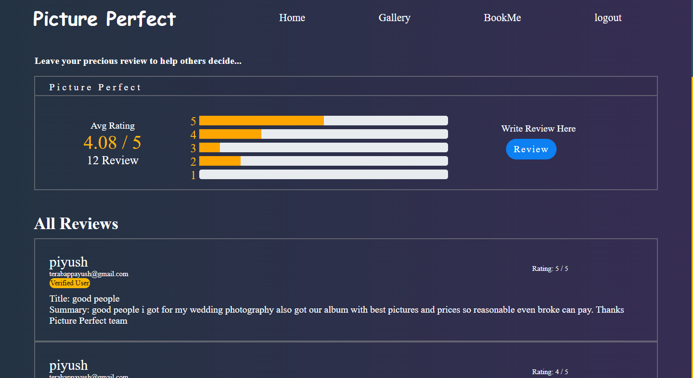
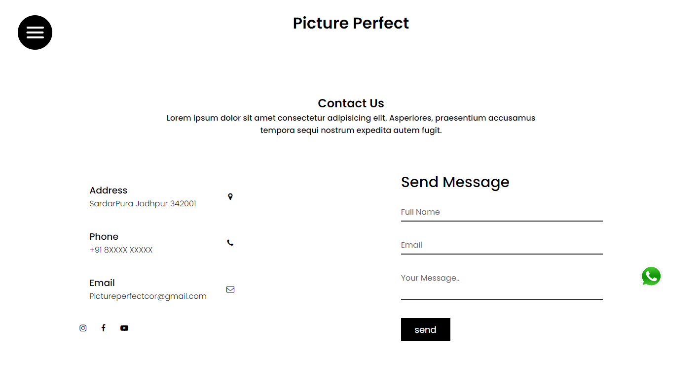

<h1># Picture-Perfect-git</h1>

College project made in order to provide photographers easier access to all their customers. 
Customers also gets easier way to contact, Place orders and look at the awesome selection of pics by photographer.

<h2>Main-Page:-</h2>

Providing a Main page with beautiful design to attract users while also showing skills of photographer and showing list of categories.

<h2>Registration form:-</h2>

Providing a Registration form where user can signup/signin with all the possible validation required and also email verification.
providing forget password option too.

<h2>Review us:-</h2>

Providing user a way to give their valuable opinion on the skills and packages provided by photographer.
Review us page is made utilising power of ajax and thus no loading time.

<h2>BookMe:-</h2>

We have three packages available for our user that they can choose from according to their occasion.
Implemented Stripe payment Gateway method for users to buy directly online.

<h2>Dashboard:-</h2>

Once they bought our package Customer will get access to Dashboard where they will get their valuable images from photographer directly.
This Dashboard will also help photographer to update their gallery image and to send the images to desired customer.

<h2>Contact:-</h2>

Users have multiple option to contact us including whatsapp,msg or Email us directly through website's Contact page.

<h2>Gallery:-</h2>

Users can see the images captured by photographer from this section, Its a dynamic section fetching images from database.
Photographer can add more images in here through Dasboard.

Project Report:-[project report p1 group.pdf](https://github.com/piyush-ops/Picture-Perfect-git/files/11016817/project.report.p1.group.pdf)

